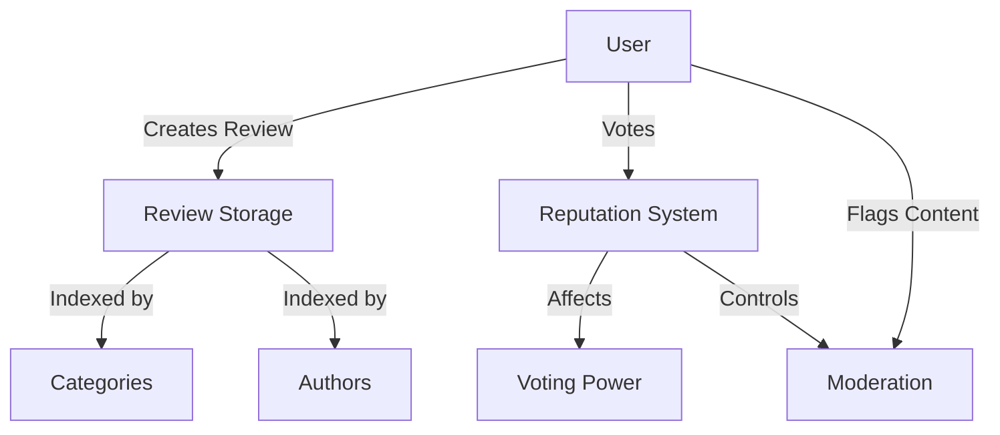

# PopNest Community Reviews Platform

A decentralized platform for community-owned pop culture reviews, where users can post, discover, and reward high-quality content through a reputation-based system.

## Overview

PopNest revolutionizes how we share and discover reviews by creating a trustless, community-driven platform. Unlike traditional review sites, PopNest ensures:

- Censorship resistance through blockchain-based storage
- Fair compensation for content creators
- Community-driven quality control via reputation mechanisms
- Transparent moderation through collective governance

Users can review movies, music, books, TV shows, games, and other pop culture content while earning reputation based on community reception.

## Architecture

The platform is built on a reputation-weighted voting system where high-quality content and contributors naturally rise to prominence.



### Core Components

1. **Review System**: Permanent on-chain storage of reviews with metadata
2. **Reputation System**: Tracks user credibility and influence
3. **Voting Mechanism**: Allows community curation of content
4. **Category Management**: Organizes content by media type
5. **Moderation System**: Community-driven content flagging

## Contract Documentation

### popnest-reviews.clar

The main contract managing all platform functionality.

#### Key Features:

- Review creation and storage
- Reputation tracking
- Voting system
- Content categorization
- Community moderation

#### Access Control:
- Anyone can create reviews and vote
- Flagging requires minimum reputation (10 points)
- Users can't vote on their own reviews
- Double-voting prevention

## Getting Started

### Prerequisites

- Clarinet
- Stacks wallet

### Basic Usage

1. Initialize user reputation:
```clarity
(contract-call? .popnest-reviews init-user-reputation)
```

2. Create a review:
```clarity
(contract-call? .popnest-reviews create-review 
    "Movie Title" 
    "Great movie review content..." 
    u1 ;; CATEGORY-MOVIE 
    "The Movie Name" 
    u8 ;; Rating out of 10
)
```

## Function Reference

### Public Functions

```clarity
(create-review (title (string-utf8 100)) 
               (content (string-utf8 5000)) 
               (category uint) 
               (item-name (string-utf8 100)) 
               (rating uint))
```
Creates a new review

```clarity
(upvote-review (review-id uint))
```
Upvotes a review and rewards the author

```clarity
(downvote-review (review-id uint))
```
Downvotes a review and penalizes the author

```clarity
(flag-review (review-id uint) (reason (string-utf8 200)))
```
Flags inappropriate content (requires reputation ≥ 10)

### Read-Only Functions

```clarity
(get-review (review-id uint))
(get-reputation (user principal))
(get-reviews-by-category (category uint))
(get-reviews-by-author (author principal))
(has-voted (user principal) (review-id uint))
```

## Development

### Testing

1. Clone the repository
2. Install Clarinet
3. Run tests:
```bash
clarinet test
```

### Local Development

1. Start Clarinet console:
```bash
clarinet console
```

2. Deploy contract:
```clarity
(contract-call? .popnest-reviews init-user-reputation)
```

## Security Considerations

### Limitations

- Review content is public and immutable
- Reputation can't go below base level (1)
- Maximum 100 reviews per category list
- Maximum 100 reviews per author list

### Best Practices

1. Always initialize reputation before interacting
2. Verify review ID exists before voting
3. Check reputation before attempting to flag content
4. Ensure content meets length and format requirements
5. Be aware of reputation penalties for downvoted content

The contract includes safety checks for:
- Double voting
- Self-voting
- Invalid categories
- Invalid ratings
- Empty content
- Unauthorized actions